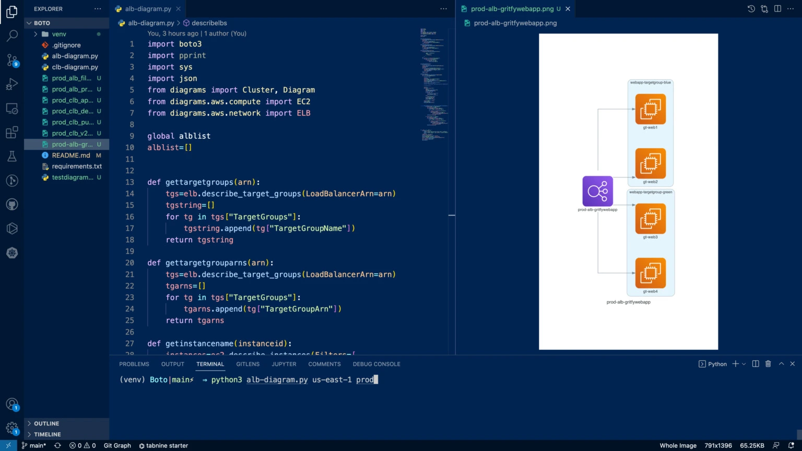

# alb list 

Python Boto scripts to list all the ALB, NLB and CLB in your AWS account with their associations and mappings like Target group, Targets etc.

* `alb-list.py`     - to list the Application and Network Load balancer and their and targets
* `clb-list.py`     - to list the Classic Load balancers and their targets
* `alb-json.py`     - list Application and Network load balancer and their targets as JSON
* `clb-json.py`     - to list the Classic Load balancers and their targets as JSON
* `alb-diagram.py`  - Create a Flowchart Diagram of your Application and Network Loadbalancers and their target 
* `clb-diagram.py`  - Create a flowchart diagram for your Classic Load balancers and their target

## How it works

* The script is designed on Python Boto3 framework
* It connects to your AWS infrastructure account using the AWS Environment variables from your terminal
* Collects all the data and create a meaningful report in JSON and Table format

## For further information and Demo

Please visit our blog at https://www.middlewareinventory.com/blog/aws-boto-script-list-all-elb-with-targetgroup-and-instance-health 

## ALB List as a Diagram - Create Automatic Flow charts of your LBs

Why just listing in CLI while you can create a Flow chart automatically using the latest upgrade of our scripts.

Yes we have also upgraded these scripts to create Flow charts based on the data collected using Python Diagram framework.

use the `alb-diagram.py` or `clb-diagram.py` 

or Learn how to use it here 

https://www.middlewareinventory.com/blog/creating-elb-flow-charts-using-python-boto-diagrams/

## For Further questions and Support

Please comment in the respective blog posts or send email to us at hello@gritfy.com

